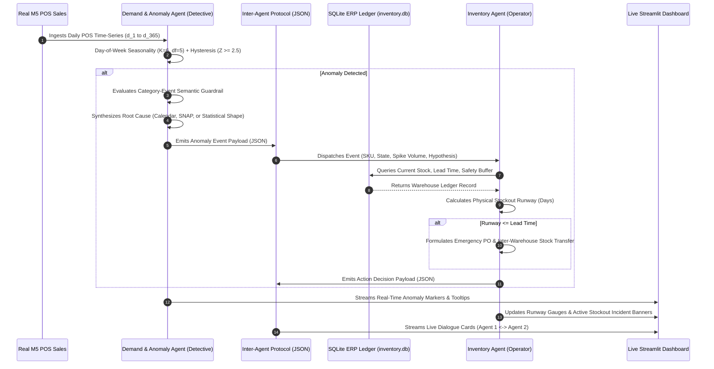

# Autonomous Multi-Agent Demand-Sensing & Inventory Rebalancing System

[](https://www.python.org/)
[](https://streamlit.io/)
[](https://www.sqlite.org/)
[](https://mofc.unic.ac.cy/m5-competition/)
[](#system-architecture)

An enterprise-grade system demonstrating an **Autonomous Multi-Agent Retail Supply-Chain Defense Network**. The architecture pairs statistical time-series anomaly detection with causal semantic guardrails and an active inventory state machine to sense retail demand shocks in real-time and autonomously coordinate warehouse rebalancing actions.

---

## 1. System Architecture



---

## 2. Key Technical Innovations

### I. Category-Event Semantic Relevance Guardrail (Spurious Correlation Defense)
Conventional retail AI blindly pairs any holiday on the calendar with a sales spike. Our system enforces an explicit **Category-Event Semantic Affinity Matrix**:
* **SNAP Welfare (Food Stamps):** Legally restricted to `FOODS` ($\text{Affinity} = 1.0$). Spikes in `HOUSEHOLD` or `HOBBIES` on SNAP days **reject** the event as spurious correlation ($\text{Affinity} = 0.0$) and route to statistical shape heuristics.
* **SuperBowl Sunday:** High affinity for `FOODS` party snacks ($0.95$); zero/low affinity for `HOUSEHOLD` ($0.10$).

### II. Physical Warehouse Clamping & Unmet Demand Accounting
Physical warehouses cannot hold negative stock. Our state machine strictly computes:
$$\text{Fulfilled\_Demand}_t = \min(\text{Opening\_Stock}_t, D_t)$$
$$\text{Current\_Stock}_t = \max(0, \text{Opening\_Stock}_t - D_t)$$
$$\text{Unmet\_Demand}_t = \max(0, D_t - \text{Opening\_Stock}_t)$$
When $\text{Unmet\_Demand} > 0$, the system fires an **`ACTIVE_STOCKOUT_INCIDENT`** rather than a predictive warning.

### III. Rolling Multi-Day State Machine (Chicken-and-Egg Resolution)
When a spike occurs on Day $t$, its longevity is unknown. The system does not lock in a premature one-shot verdict:
* **Day $t$:** Issues a `🟡 PROVISIONAL_ALERT` with dual-runway brackets (Best-Case Impulse vs. Worst-Case Sustained).
* **Day $t+1$ (3-Zone Reconciliation):**
  * $Z_{t+1} \le 1.0 \to$ `🟢 DOWNGRADED (RESOLVED_ONE_OFF)`
  * $1.0 < Z_{t+1} < 2.0 \to$ `🟠 PARTIALLY_ELEVATED_WATCH` (Amber cooling state)
  * $Z_{t+1} \ge 2.0 \to$ `🔴 ELEVATED_SURGE (DAY 2)`
* **Day $t+2$:** If surge sustains for 3 consecutive days, executes a **Changepoint Re-Anchoring**, updating the baseline upward to $\mu_{\text{new}}$ while archiving the pre-shift baseline for audit compliance.

### IV. Hysteresis Dual-Threshold Design
* **Entry Barrier ($Z_t \ge 2.5$):** Prevents false alarms on routine seasonal noise (~99th empirical percentile).
* **Exit Barrier ($Z_{t+1} \le 1.0$):** Emergency logistics do not stand down until demand fully returns to the standard noise band ($\le 1.0\sigma$).

---

## 3. Data Provenance & Transparency

| Layer | Source | Details |
| :--- | :--- | :--- |
| **Point-of-Sale Demand** | **100% Real Walmart M5 Benchmark** | 9,147 daily time-series across California (`CA`), Texas (`TX`), and Wisconsin (`WI`) for 365 continuous days. Verified 0 null values. |
| **Warehouse Inventory Ledger** | **Active SQLite State Machine (`inventory.db`)** | Production warehouses keep inventory proprietary. We model an active SQLite ledger enforcing safety stocks, replenishment batch sizes, lead times, and zero-clamping. |

---

## 4. Curated Demo Hero SKUs

Mathematically ranked by Coefficient of Variation ($CV = \frac{\sigma}{\mu}$) and peak surge ratios:

1. **`FOODS_3_090_TX_1` (SuperBowl Hero):** Normal 18.0 units/day surges to **177 units** on SuperBowl Sunday (Feb 6, 2011; 9.3x spike).
2. **`FOODS_2_285_TX_1` (Mega SNAP Spike):** Normal 7.3 units/day explodes to **634 units** (86.6x spike) on Texas SNAP welfare disbursement day.
3. **`FOODS_3_030_CA_1` (California Regional Surge):** Normal 7.5 units/day jumps to **195 units** (25.9x spike).
4. **`HOBBIES_1_209_TX_1` (Semantic Guardrail Proof):** Normal 2.8 units/day jumps to **96 units** on a SNAP day; AI rejects SNAP as irrelevant to hobbies and detects B2B wholesale impulse.
5. **`HOUSEHOLD_2_440_TX_1` (Boxing Day Clean-up):** Normal 2.8 units/day jumps to **65 units** (23.4x spike) on the day after Christmas.

---

## 5. Repository Structure

```
├── data_m5_daily_365.csv      # Real extracted Walmart M5 dataset (9,147 series, 365 days)
├── top_5_demo_skus.csv        # Curated top-variance demo products with metadata
├── extract_m5_data.py         # M5 automated extraction pipeline
├── verify_step1.py            # Integrity audit and calendar alignment script
├── compute_step2_variance.py  # CV variance computation and SKU ranking
├── save_curated_top5.py       # Final curated dataset generator
├── app.py                     # Interactive Streamlit Multi-Agent Dashboard (In Progress)
├── requirements.txt           # Production dependencies
└── README.md                  # System architecture documentation
```

---

## 6. Quickstart & Local Setup

```bash
# 1. Clone repository
git clone https://github.com/Priyanshiag1/autonomous-supply-chain-agent.git
cd autonomous-supply-chain-agent

# 2. Install dependencies
pip install -r requirements.txt

# 3. Launch interactive dashboard
streamlit run app.py
```

